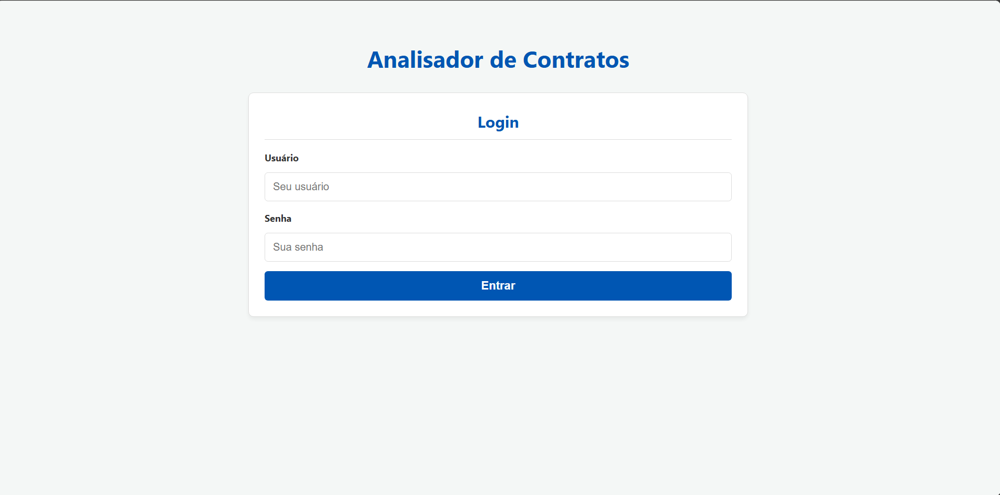
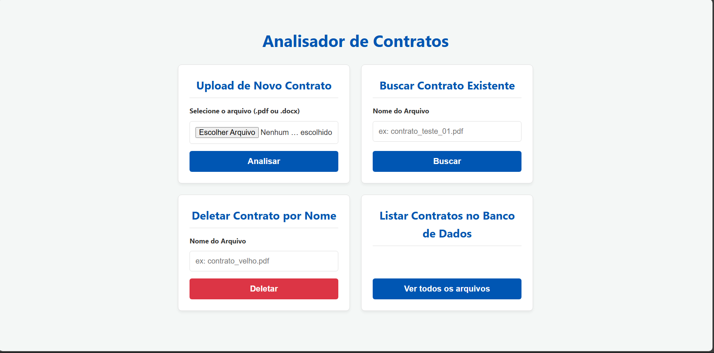
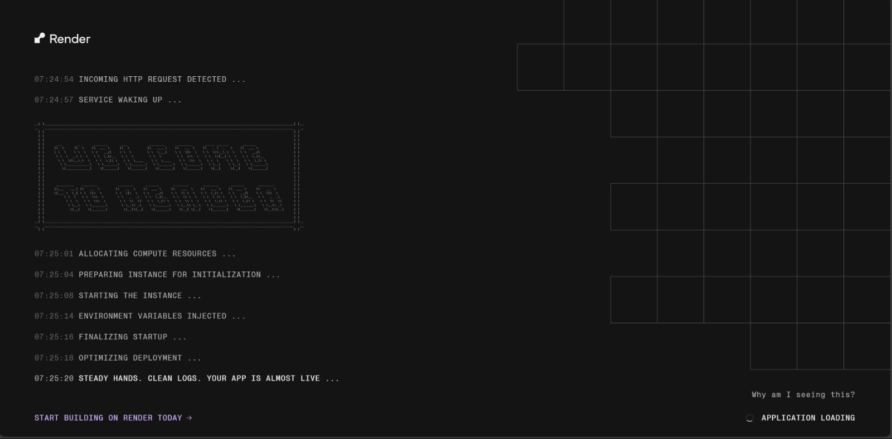
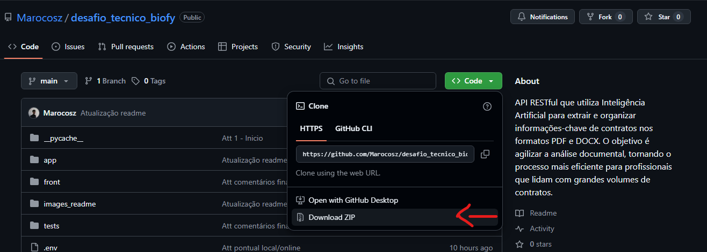

# Analisador de Contratos com IA

API RESTful que utiliza Inteligência Artificial para extrair e organizar informações-chave de contratos nos formatos PDF e DOCX. O objetivo é agilizar a análise documental, tornando o processo mais eficiente para profissionais que lidam com grandes volumes de contratos.

## ⚙️ Tecnologias Utilizadas

- [Langchain](https://www.langchain.com/)
- [FastAPI](https://fastapi.tiangolo.com/)
- [SQLModel](https://sqlmodel.tiangolo.com/)
- [PyPDF2](https://pypi.org/project/PyPDF2/)

## 📑 Tópicos

1. Construção  
2. Funcionalidades  
3. Frontend  
4. Site Hospedado  
5. Como usar na sua máquina  

---

## 1 - Construção 🏗️

A aplicação foi desenvolvida em **Python 3.13.15**, com suporte a dois bancos de dados relacionais: **MySQL** e **PostgreSQL** (hospedado via Render).

A estrutura foi organizada em módulos, promovendo legibilidade, escalabilidade e facilidade de manutenção.

### 📁 Estrutura de Diretórios

```text
📂 app/
├── 📁 __pycache__/
├── 📄 __init__.py
├── 📄 auth.py
├── 📄 crud.py
├── 📄 database.py
├── 📄 main.py
├── 📄 models.py
├── 📄 processing.py
├── 📄 schemas.py
└── 📄 utils.py
📂 front/
├── 📄 index.html
├── 📄 script.js
└── 📄 style.css
📂 tests/
├── 📁 __pycache__/
├── 📄 __init__.py
├── 📄 conftest.py
└── 📄 test_api.py
```

### 📦 Organização dos Módulos

A pasta `app/` é responsável por toda a lógica da aplicação e contém os seguintes arquivos:

- `auth.py`: gerencia a autenticação de usuários.
- `crud.py`: implementa operações de Create, Read, Update e Delete no banco de dados.
- `database.py`: configuração e inicialização do banco de dados.
- `main.py`: define os endpoints e lógica principal da API.
- `models.py`: contém os modelos das tabelas do banco (`User`, `Contract`).
- `processing.py`: integração com a IA (Gemini 2.5-flash) para extração dos dados via prompt.
- `schemas.py`: define os esquemas de entrada e saída da API com Pydantic.
- `utils.py`: funções auxiliares para leitura e manipulação de arquivos `.pdf` e `.docx`.

A pasta `front/` contém a interface web, composta por:

- `index.html`: estrutura básica da interface.
- `script.js`: lógica de integração com a API via JavaScript.
- `style.css`: estilização da interface.

### 🧪 Testes

Com o auxílio da biblioteca **PyTest**, foram desenvolvidos testes automatizados localizados na pasta `tests/`. Esses testes cobrem os principais fluxos da aplicação, incluindo rotas públicas, autenticação, upload e acesso a endpoints protegidos.

Abaixo estão os cenários testados:

#### ✅ Rotas públicas

- `GET /`  
- `POST /users/`  
  Payload de exemplo:
  ```json
  {
    "username": "testuser",
    "password": "testpassword"
  }
  ```

#### 🔐 Fluxo de autenticação

- `POST /users/`  
  ```json
  {
    "username": "logintest",
    "password": "password123"
  }
  ```
- `POST /login`  
  Enviado como dados de formulário:
  ```text
  username=authuser&password=password123
  ```

#### 🔒 Acesso a rotas protegidas

- `GET /contracts/list/filenames`  
- `POST /login` com autenticação e geração de token JWT

#### 📤 Teste de upload com IA simulada

Foi utilizada uma função mock que simula a resposta da IA, interceptando a chamada real ao modelo e retornando dados fictícios. Isso permite testar o comportamento da API sem depender da comunicação direta com a IA, garantindo agilidade e isolamento nos testes.

---

Esses testes aumentam a confiabilidade da aplicação e ajudam a prevenir regressões, garantindo que os principais fluxos funcionem corretamente antes de cada deploy.

## 2 - Funcionalidades da API 🚀

A seguir estão listadas todas as rotas disponíveis com exemplos de requisição, parâmetros, tipos e respostas presentes em main.py.

---

### `GET /`

**Descrição**: Verifica se a API está online.

**Resposta (JSON)**:

```json
{ "status": "API is running!" }
```
---

### `POST /users/`

**Descrição**: Cria um novo usuário.

**Parâmetros (JSON Body, schemas.UserCreate)**:

```json
{
  "username": "joao",
  "password": "senha123"
}
```

**Resposta (models.UserRead)**:

```json
{
  "id": 1,
  "username": "joao"
}
```
---

### `POST /login`

**Descrição**: Realiza o login e retorna um token JWT.

**Parâmetros (form-data)**:
- username: Nome de usuário (string)
- password: Senha (string)

**Resposta (schemas.Token)**:

```json
{
  "access_token": "<jwt_token>",
  "token_type": "bearer"
}
```

---

### `GET /users/me`

**Descrição**: Retorna os dados do usuário autenticado.

**Cabeçalho**:
- Authorization: Bearer <token>

**Resposta (models.UserRead)**:

```json
{
  "id": 1,
  "username": "joao"
}
```

---

### `POST /contracts/upload`

**Descrição**: Envia um contrato para ser processado pela IA.

**Parâmetros**:
- Arquivo .pdf ou .docx (campo file, via multipart/form-data)

**Cabeçalho**:
- Authorization: Bearer <token>

**Resposta (models.Contract)**:

```json
{
  "id": 2,
  "filename": "contrato1.pdf",
  "status": "completed",
  "contracting_party": "Empresa A",
  "contracted_party": "Empresa B",
  "contract_value": "R$ 500.000",
  "main_obligations": "Entrega mensal de produtos",
  "additional_data": "Válido por 12 meses",
  "termination_clause": null
}
```

---

### `GET /contracts/{contract_name}`

**Descrição**: Busca os dados de um contrato pelo nome do arquivo.

**Parâmetros de rota**:
- contract_name (string): Exemplo: contrato1.pdf

**Cabeçalho**:
- Authorization: Bearer <token>

**Resposta (models.Contract)**:

```json
{
  "id": 2,
  "filename": "contrato1.pdf",
  "status": "completed",
  "contracting_party": "Empresa A",
  "contracted_party": "Empresa B",
  "contract_value": "R$ 500.000",
  "main_obligations": "Entrega mensal de produtos",
  "additional_data": "Dados adicionais aqui",
  "termination_clause": "Cláusula de rescisão"
}
```

---

### `GET /contracts/list/filenames`

**Descrição**: Lista todos os nomes dos contratos existentes.

**Cabeçalho**:
- Authorization: Bearer <token>

**Resposta (lista de strings)**:

```txt
[
  "contrato1.pdf",
  "contrato2.docx"
]
```
---

### `DELETE /contracts/{contract_id}`

**Descrição**: Exclui um contrato pelo ID.

**Parâmetro de rota**:
- contract_id (int): Exemplo: 2

**Cabeçalho**:
- Authorization: Bearer <token>

**Resposta (models.Contract)**:

```json
{
  "id": 2,
  "filename": "contrato1.pdf",
  "status": "completed",
  "contracting_party": "Empresa A",
  "contracted_party": "Empresa B",
  "contract_value": "R$ 500.000",
  "main_obligations": "Entrega mensal de produtos",
  "additional_data": "Dados adicionais aqui",
  "termination_clause": "Cláusula de rescisão"
}
```
---

## 3 - Frontend 🌐

### Tela inicial de Login - Usuário e Senha


### Tela secundária com a implementação


Não irei me aprofundar muito na implementação do frontend, mas basicamente a comunicação foi feita diretamente via JavaScript com a API, utilizando requisições assíncronas (`fetch`). O código manipula a interface exibindo ou ocultando seções conforme o usuário realiza login, upload, busca, listagem ou exclusão de contratos.

O fluxo geral funciona assim:

- **Login:** Envia os dados via `POST /login`, recebe o token JWT e, se o login for bem-sucedido, exibe a interface principal para o usuário.
- **Upload:** Permite enviar um arquivo PDF ou DOCX para a API (`POST /contracts/upload`), exibindo mensagens de status e resultados formatados.
- **Busca:** Consulta um contrato pelo nome do arquivo (`GET /contracts/{filename}`) e apresenta os dados retornados em formato JSON formatado.
- **Listagem:** Busca todos os nomes dos contratos existentes (`GET /contracts/list/filenames`) e os exibe numa lista na página.
- **Exclusão:** Permite deletar um contrato pelo nome; para isso, primeiro busca o contrato para obter seu ID e depois realiza a exclusão via `DELETE /contracts/{id}`, mostrando feedback visual e mensagens adequadas.

Além disso, o código controla o estado dos botões e indicadores de carregamento para garantir boa usabilidade e prevenir múltiplos envios simultâneos, além de tratar erros exibindo mensagens claras para o usuário.

Em resumo, a interface é leve e responsiva, fazendo chamadas REST para a API e atualizando dinamicamente o conteúdo da página com os dados retornados, sem necessidade de recarregar a página.

---

## 4 - Site Hospedado 💻

O site, a API e o banco de dados PostgreSQL estão completamente hospedados na plataforma [Render](https://render.com/), utilizando a versão gratuita do serviço. 

É importante destacar que, devido às limitações da camada gratuita, os serviços podem entrar em um estado de "hibernação" ou inatividade após períodos sem uso, o que pode causar um pequeno atraso no tempo de resposta inicial quando o sistema é acessado novamente. Além disso, o plano gratuito oferece recursos limitados de processamento e memória, o que pode impactar a performance em picos de uso ou operações mais pesadas (Principalmente da API).

#### Tela de exemplo de espera


[👉 Acesse o site aqui](https://site-contratos-marcos.onrender.com/)
[👉 Acesse a API aqui](https://analisador-contratos.onrender.com/)

> ⚠️ **Observação:** Recomenda-se utilizar o banco de dados **MySQL** ao rodar a API ou o site localmente, pois sua configuração é mais simples nesse contexto.  
> 
> No entanto, para a versão hospedada, foi utilizado o **PostgreSQL** (via Render), mantendo a mesma estrutura e lógica de acesso ao banco de dados.  
>
> No próximo tópico, você aprenderá como rodar o projeto localmente com o banco configurado corretamente.


## 5 - Como usar na sua máquina ❓

### ✅ Pré-requisitos

- **Python 3.13.15** (recomendado, versões 3.10+ também devem funcionar)
- **Editor de código** (Recomendo o [Visual Studio Code](https://code.visualstudio.com/))
- **Chave da API do Gemini**

---

### 🧭 Passo a passo

1. **Clone o repositório**
   
   Abra o terminal na pasta onde deseja salvar o projeto e execute:

   ```bash
   git clone https://github.com/Marocosz/desafio_tecnico_biofy.git
   ```

   Ou, se preferir, baixe o `.zip` diretamente pelo GitHub:

   

---

2. **Crie o ambiente virtual**

   No terminal, dentro da pasta do projeto, execute:

   ```bash
   python -m venv venv
   ```

   Depois ative com:

   ```bash
   .\venv\Scripts\activate
   ```

   > Obs: Em alguns casos no PowerShell, você pode precisar executar diretamente o script `Activate.ps1` dentro da pasta `venv\Scripts`.

---

3. **Instale as dependências**

   Com o ambiente virtual ativado, instale as bibliotecas com:

   ```bash
   pip install -r requirements.txt
   ```

   > O arquivo `requirements.txt` já está no repositório e contém apenas as bibliotecas essenciais para o projeto.

---

4. **Configuração do ambiente**

   Crie um arquivo `.env` na raiz do projeto com o seguinte conteúdo:

   ```env
   GEMINI_API_KEY="sua_key_api"
   JWT_KEY="sua_encryption_key"
   ```

   - A variável `GEMINI_API_KEY` deve conter sua chave da API do Gemini.
   - Para `JWT_KEY`, recomendo usar uma chave com 256 bits (32 caracteres aleatórios) para segurança do sistema de autenticação JWT.

---

5. **Adaptação para ambiente local**

   #### a) Arquivo `database.py`  
   Localize e edite as seguintes linhas:

   ```python
   # Linha 5 - Comente a opção online:
   # DATABASE_URL = os.getenv("DATABASE_URL", "sqlite:///database.db")  # Online

   # Linha 6 - Descomente a opção local:
   DATABASE_URL = "sqlite:///database.db"  # Local
   ```

   #### b) Arquivo `script.js`  
   Atualize a URL da API:

   ```js
   // De:
   const API_URL = 'https://analisador-contratos.onrender.com';

   // Para:
   const API_URL = 'http://127.0.0.1:8000';
   ```

---

### 📦 Sobre as dependências

> O `requirements.txt` está "enxuto", mas se necessário, segue abaixo a lista completa de pacotes que tenho instalados no ambiente local (incluindo possíveis bibliotecas de outros projetos pessoais):

<details>
<summary>Clique para expandir a lista completa de dependências</summary>

```text
accelerate==1.8.1
aiofiles==24.1.0
aiohappyeyeballs==2.6.1
aiohttp==3.12.14
aiosignal==1.4.0
annotated-types==0.7.0
antlr4-python3-runtime==4.9.3
anyio==4.9.0
attrs==25.3.0
backoff==2.2.1
bcrypt==4.3.0
beautifulsoup4==4.13.4
cachetools==5.5.2
certifi==2025.7.14
cffi==1.17.1
chardet==5.2.0
charset-normalizer==3.4.2
click==8.2.1
colorama==0.4.6
coloredlogs==15.0.1
contourpy==1.3.2
cryptography==45.0.5
cycler==0.12.1
dataclasses-json==0.6.7
deepdiff==8.5.0
Deprecated==1.2.18
dnspython==2.7.0
ecdsa==0.19.1
effdet==0.4.1
email_validator==2.2.0
emoji==2.14.1
et_xmlfile==2.0.0
fastapi==0.116.1
fastapi-cli==0.0.8
fastapi-cloud-cli==0.1.4
filelock==3.18.0
filetype==1.2.0
flatbuffers==25.2.10
fonttools==4.58.5
frozenlist==1.7.0
fsspec==2025.7.0
google-ai-generativelanguage==0.6.18
google-api-core==2.25.1
google-auth==2.40.3
google-cloud-vision==3.10.2
googleapis-common-protos==1.70.0
greenlet==3.2.3
grpcio==1.73.1
grpcio-status==1.73.1
gunicorn==23.0.0
h11==0.16.0
html5lib==1.1
httpcore==1.0.9
httptools==0.6.4
httpx==0.28.1
httpx-sse==0.4.1
huggingface-hub==0.33.4
humanfriendly==10.0
idna==3.10
iniconfig==2.1.0
itsdangerous==2.2.0
Jinja2==3.1.6
joblib==1.5.1
jsonpatch==1.33
jsonpath-python==1.0.6
jsonpointer==3.0.0
kiwisolver==1.4.8
langchain==0.3.26
langchain-community==0.3.27
langchain-core==0.3.69
langchain-google-genai==2.1.8
langchain-text-splitters==0.3.8
langchain-unstructured==0.1.5
langdetect==1.0.9
langsmith==0.4.6
lxml==6.0.0
Markdown==3.8.2
markdown-it-py==3.0.0
MarkupSafe==3.0.2
marshmallow==3.26.1
matplotlib==3.10.3
mdurl==0.1.2
mpmath==1.3.0
multidict==6.6.3
mypy_extensions==1.1.0
nest-asyncio==1.6.0
networkx==3.5
nltk==3.9.1
numpy==2.2.6
olefile==0.47
omegaconf==2.3.0
onnx==1.18.0
onnxruntime==1.22.1
opencv-python==4.12.0.88
openpyxl==3.1.5
orderly-set==5.5.0
orjson==3.11.0
packaging==25.0
pandas==2.3.1
passlib==1.7.4
pdf2image==1.17.0
pdfminer.six==20250506
pi_heif==1.0.0
pikepdf==9.10.0
pillow==11.3.0
pluggy==1.6.0
propcache==0.3.2
proto-plus==1.26.1
protobuf==6.31.1
psutil==7.0.0
psycopg2==2.9.10
pyasn1==0.6.1
pyasn1_modules==0.4.2
pycocotools==2.0.10
pycparser==2.22
pydantic==2.11.7
pydantic-extra-types==2.10.5
pydantic-settings==2.10.1
pydantic_core==2.33.2
Pygments==2.19.2
pypandoc==1.15
pyparsing==3.2.3
pypdf==5.8.0
PyPDF2==3.0.1
pypdfium2==4.30.1
pyreadline3==3.5.4
pytest==8.4.1
python-dateutil==2.9.0.post0
python-docx==1.2.0
python-dotenv==1.1.1
python-iso639==2025.2.18
python-jose==3.5.0
python-magic==0.4.27
python-multipart==0.0.20
python-oxmsg==0.0.2
python-pptx==1.0.2
pytz==2025.2
PyYAML==6.0.2
RapidFuzz==3.13.0
regex==2024.11.6
requests==2.32.4
requests-toolbelt==1.0.0
rich==14.0.0
rich-toolkit==0.14.8
rignore==0.6.2
rsa==4.9.1
safetensors==0.5.3
scipy==1.16.0
sentry-sdk==2.33.0
setuptools==80.9.0
shellingham==1.5.4
six==1.17.0
sniffio==1.3.1
soupsieve==2.7
SQLAlchemy==2.0.41
sqlmodel==0.0.24
starlette==0.47.1
sympy==1.14.0
tenacity==9.1.2
timm==1.0.17
tokenizers==0.21.2
torch==2.7.1
torchvision==0.22.1
tqdm==4.67.1
transformers==4.53.2
typer==0.16.0
typing-inspect==0.9.0
typing-inspection==0.4.1
typing_extensions==4.14.1
tzdata==2025.2
ujson==5.10.0
unstructured==0.18.7
unstructured-client==0.25.9
unstructured-inference==1.0.5
unstructured.pytesseract==0.3.15
urllib3==2.5.0
uvicorn==0.35.0
watchfiles==1.1.0
webencodings==0.5.1
websockets==15.0.1
wrapt==1.17.2
xlrd==2.0.2
xlsxwriter==3.2.5
yarl==1.20.1
zstandard==0.23.0
```

</details>

---

### 🚀 Pronto!

Com tudo configurado, você já pode rodar a aplicação localmente.

#### 1️⃣ Iniciar a API

Com o ambiente virtual (`venv`) ativado, execute o seguinte comando para iniciar a API FastAPI:

```bash
uvicorn main:app --reload
```

A API estará acessível em: [http://127.0.0.1:8000](http://127.0.0.1:8000)

Você também pode visualizar a documentação interativa da API em:
- [Swagger UI](http://127.0.0.1:8000/docs)
- [Redoc](http://127.0.0.1:8000/redoc)

---

#### 2️⃣ Iniciar o site (frontend)

Abra **um novo terminal** (com a `venv` ativada), navegue até a pasta do projeto e execute:

```bash
python -m http.server 8080
```

O servidor local estará disponível em:

[http://localhost:8080](http://localhost:8080)

Nele, localize e entre na pasta `front` para acessar o site.


### Criando seu usuário

Para criar seu usuário, acesse a documentação da API no Swagger UI:

- Local: [http://127.0.0.1:8000/docs](http://127.0.0.1:8000/docs)  
- Online: [https://analisador-contratos.onrender.com/docs](https://analisador-contratos.onrender.com/docs)

---

### Passo a passo para criar e autenticar um usuário

#### 1️⃣ Criar um usuário

- Navegue até o endpoint **POST /users/**.  
- Clique em **"Try it out"**.  
- No corpo da requisição, informe o username e password, por exemplo:

    {
      "username": "marco",
      "password": "123"
    }

- Clique em **"Execute"**.  
- Se tudo ocorrer bem, você verá a resposta indicando que o usuário foi criado com sucesso.

---

#### 2️⃣ Fazer login

- Navegue até o endpoint **POST /login**.  
- Clique em **"Try it out"**.  
- No corpo da requisição, informe o mesmo username e password usados na criação, exemplo:

    {
      "username": "marco",
      "password": "123"
    }

- Clique em **"Execute"**.  

---

#### 3️⃣ Acessar endpoints protegidos

- Navegue até o endpoint **GET /users/me**.  
- No canto superior direito da página do Swagger, clique em **"Authorize"** (um cadeado).  
- Coloque as credenciais (username e password) que você criou anteriormente.
- Clique em **"Authorize"** e depois feche a janela.  
- Agora, no endpoint **GET /users/me**, clique em **"Try it out"** e depois em **"Execute"** para testar o acesso autenticado.

---

Pronto! Você criou seu usuário, autenticou e acessou um endpoint protegido usando o token JWT via Swagger UI.


---

### 🛠 Suporte

Se tiver dúvidas, sugestões ou encontrar algum erro, sinta-se à vontade para abrir uma _issue_ no repositório:

👉 [https://github.com/Marocosz/desafio_tecnico_biofy.git](https://github.com/Marocosz/desafio_tecnico_biofy.git)


